#  线性回归

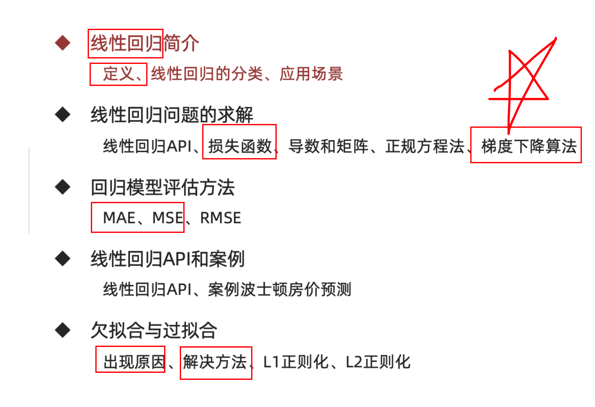

## 回归评估方法

**学习目标：**

1.掌握常用的回归评估方法

2.了解不同评估方法的特点


**为什么要进行线性回归模型的评估**

我们希望衡量预测值和真实值之间的差距，

会用到MAE、MSE、RMSE多种测评函数进行评价

### 【知道】平均绝对误差

**Mean Absolute Error (MAE)**

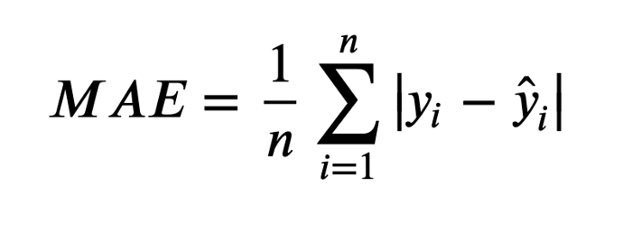

- 上面的公式中：n 为样本数量, y 为实际值, $\hat{y}$ 为预测值

- MAE 越小模型预测约准确

Sklearn 中MAE的API

```python
from sklearn.metrics import mean_absolute_error
mean_absolute_error(y_test,y_predict)
```

### 【知道】均方误差

   **Mean Squared Error (MSE)**

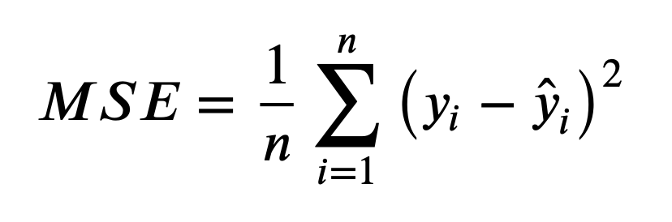

- 上面的公式中：n 为样本数量, y 为实际值, $\hat{y}$ 为预测值
- MSE 越小模型预测约准确

Sklearn 中MSE的API

```python
from sklearn.metrics import mean_squared_error
mean_squared_error(y_test,y_predict)
```

### 【知道】 均方根误差

**Root Mean Squared Error (RMSE)**


- 上面的公式中：n 为样本数量, y 为实际值, $\hat{y}$ 为预测值
- RMSE 越小模型预测约准确

### 【了解】 三种指标的比较

我们绘制了一条直线 **y = 2x +5** 用来拟合 **y = 2x + 5 + e.** 这些数据点，其中e为噪声


从上图中我们发现 MAE 和 RMSE 非常接近，都表明模型的误差很低（MAE 或 RMSE 越小，误差越小！）。 但是MAE 和 RMSE 有什么区别？为什么MAE较低？

- 对比MAE 和 RMSE的公式，RMSE的计算公式中有一个平方项，因此：大的误差将被平方，因此会增加 RMSE 的值

- 可以得出结论，RMSE 会放大预测误差较大的样本对结果的影响，而 MAE 只是给出了平均误差

- 由于 RMSE 对误差的 **平方和求平均** 再开根号，大多数情况下RMSE>MAE

  举例 (1+3)/2 = 2   $\sqrt{(1^2+3^2)/2 }= \sqrt{10/2} = \sqrt{5} = 2.236$

我们再看下一个例子

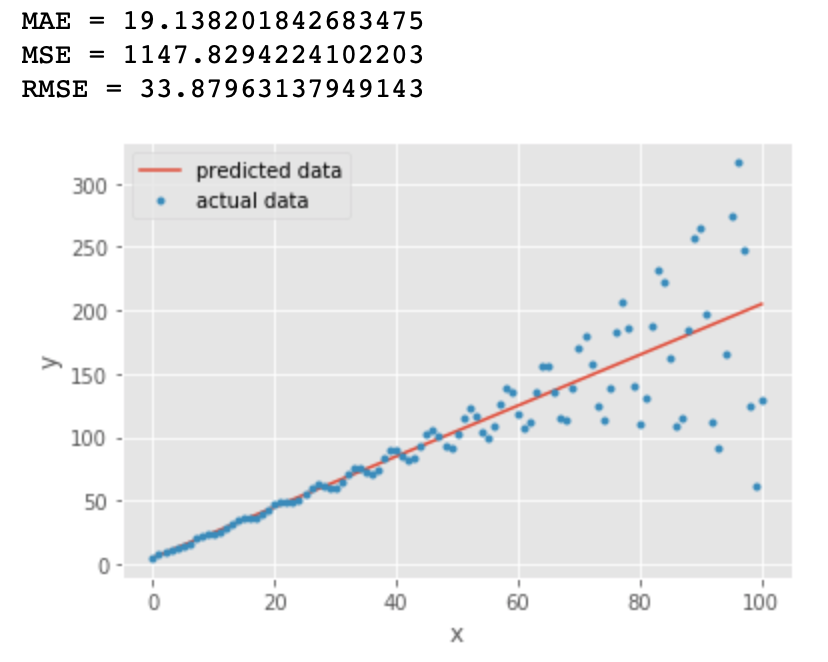

橙色线与第一张图中的直线一样：**y = 2x +5** 

蓝色的点为： **y = y + sin(x)\*exp(x/20) + e**  其中 exp() 表示指数函数

我们看到对比第一张图，所有的指标都变大了，RMSE 几乎是 MAE 值的两倍，因为它对预测误差较大的点比较敏感

我们是否可以得出结论： RMSE是更好的指标？ 某些情况下MAE更有优势，例如：

- 假设数据中有少数异常点偏差很大，如果此时根据 RMSE 选择线性回归模型，可能会选出过拟合的模型来
- 在这种情况下，由于数据中的异常点极少，选择具有最低 MAE 的回归模型可能更合适
- 除此之外，当两个模型计算RMSE时数据量不一致，也不适合在一起比较 

## 【实操】波士顿房价预测案例

### 【知道】线性回归API

sklearn.linear_model.LinearRegression(fit_intercept=True)

- 通过正规方程优化
- 参数：fit_intercept，是否计算偏置
- 属性：LinearRegression.coef_ （回归系数） LinearRegression.intercept_（偏置）

sklearn.linear_model.SGDRegressor(loss="squared_loss", fit_intercept=True, learning_rate ='constant', eta0=0.01)

- 参数：loss（损失函数类型），fit_intercept（是否计算偏置）learning_rate （学习率）
- 属性：SGDRegressor.coef_ （回归系数）SGDRegressor.intercept_ （偏置）

### 【实操】波士顿房价预测

#### 案例背景介绍

数据介绍


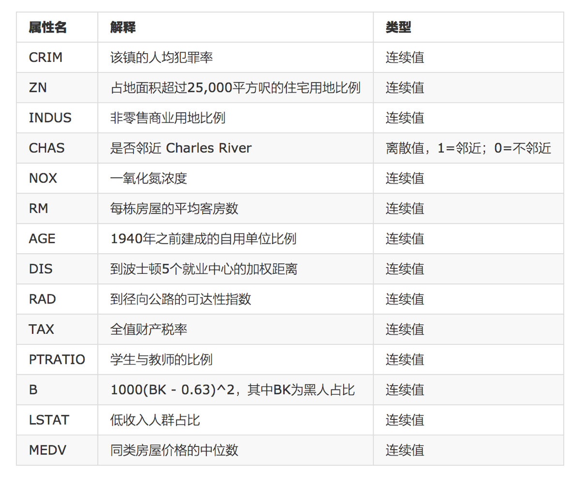

> 给定的这些特征，是专家们得出的影响房价的结果属性。我们此阶段不需要自己去探究特征是否有用，只需要使用这些特征。到后面量化很多特征需要我们自己去寻找


#### 案例分析

回归当中的数据大小不一致，是否会导致结果影响较大。所以需要做标准化处理。

- 数据分割与标准化处理
- 回归预测
- 线性回归的算法效果评估


####  回归性能评估

均方误差(Mean Squared Error, MSE)评价机制：

$\Large MSE = \frac{1}{m}\sum_{i=1}^{m}(y^i-\hat{y})^2$

sklearn中的API：sklearn.metrics.mean_squared_error(y_true, y_pred)

- 均方误差回归损失
- y_true:真实值
- y_pred:预测值
- return:浮点数结果


#### 代码实现

##### 老版本报错  

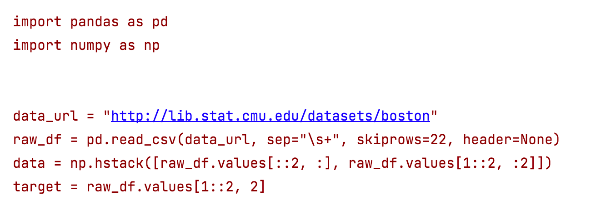

```python
# 0.导包
from sklearn.datasets import load_boston
from sklearn.model_selection import train_test_split
from sklearn.preprocessing import StandardScaler
from sklearn.linear_model import LinearRegression,SGDRegressor
from sklearn.metrics import mean_squared_error

# 1.加载数据
boston = load_boston()
# print(boston)

# 2.数据集划分
x_train,x_test,y_train,y_test =train_test_split(boston.data,boston.target,test_size=0.2,random_state=22)

# 3.标准化
process=StandardScaler()
x_train=process.fit_transform(x_train)
x_test=process.transform(x_test)

# 4.模型训练
# 4.1 实例化(正规方程)
# model =LinearRegression(fit_intercept=True)
model = SGDRegressor(learning_rate='constant',eta0=0.01)
# 4.2 fit
model.fit(x_train,y_train)

# print(model.coef_)
# print(model.intercept_)
# 5.预测
y_predict=model.predict(x_test)

print(y_predict)

# 6.模型评估

print(mean_squared_error(y_test,y_predict))


```


##### 1.2.0 以上版本实现

```python
# 0.导包
import pandas as pd
import numpy as np
from sklearn.model_selection import train_test_split
from sklearn.preprocessing import StandardScaler
from sklearn.linear_model import LinearRegression, SGDRegressor
from sklearn.metrics import mean_squared_error, mean_absolute_error, root_mean_squared_error

# 1.加载数据
data_url = "http://lib.stat.cmu.edu/datasets/boston"
raw_df = pd.read_csv(data_url, sep="\\s+", skiprows=22, header=None)
data = np.hstack([raw_df.values[::2, :], raw_df.values[1::2, :2]])
target = raw_df.values[1::2, 2]

# 2.数据集划分
x_train, x_test, y_train, y_test = train_test_split(data, target, test_size=0.2, random_state=22)

# 3.标准化
process = StandardScaler()
x_train = process.fit_transform(x_train)
x_test = process.transform(x_test)

# 4.模型训练
# 4.1 实例化
# 方式1: 正规方程
# model = LinearRegression(fit_intercept=True)
# 方式2: 随机梯度下降
# 'constant'表示使用固定的学习率。
model = SGDRegressor(learning_rate='constant', eta0=0.01)
# 4.2 fit
model.fit(x_train, y_train)
# print(model.coef_)
# print(model.intercept_)
# 5.预测
y_predict = model.predict(x_test)
print(y_predict)

# 6.模型评估
print("均方误差:", mean_squared_error(y_test, y_predict))
print("平均绝对误差:", mean_absolute_error(y_test, y_predict))
print("均方根误差:", root_mean_squared_error(y_test, y_predict))
```


## 正则化

**学习目标：**

1.掌握过拟合、欠拟合的概念

2.掌握过拟合、欠拟合产生的原因

3.知道什么是正则化，以及正则化的方法

### 【理解】 欠拟合与过拟合

过拟合：一个假设 **在训练数据上能够获得比其他假设更好的拟合， 但是在测试数据集上却不能很好地拟合数据** (体现在准确率下降)，此时认为这个假设出现了过拟合的现象。(模型过于复杂)

欠拟合：一个假设 **在训练数据上不能获得更好的拟合，并且在测试数据集上也不能很好地拟合数据** ，此时认为这个假设出现了欠拟合的现象。(模型过于简单)

过拟合和欠拟合的区别：

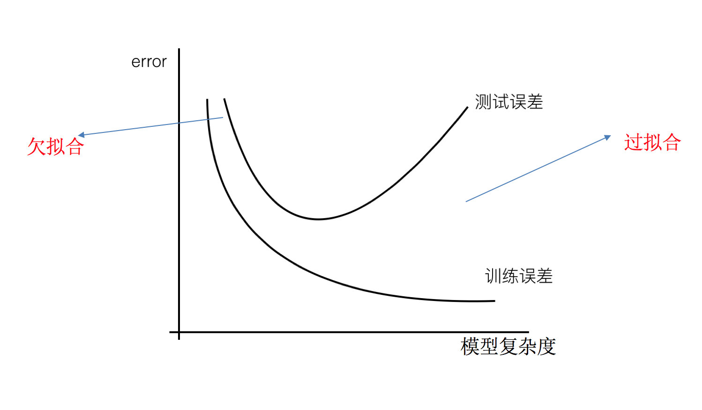

欠拟合在训练集和测试集上的误差都较大

过拟合在训练集上误差较小，而测试集上误差较大


### 【实践】通过代码认识过拟合和欠拟合

#### 欠拟合代码

```python
import numpy as np
import matplotlib.pyplot as plt
from sklearn.linear_model import LinearRegression
from sklearn.metrics import mean_squared_error  # 计算均方误差
from sklearn.model_selection import train_test_split


def dm01_欠拟合():
    # 1. 准备x, y数据, 增加上噪声.
    # 用于设置随机数生成器的种子（seed）, 种子一样, 每次生成相同序列.
    np.random.seed(666)
    # x: 随机数, 范围为 (-3, 3), 100个.
    x = np.random.uniform(-3, 3, size=100)
    # loc: 均值, scale: 标准差, normal: 正态分布.
    y = 0.5 * x ** 2 + x + 2 + np.random.normal(0, 1, size=100)
    # 2. 实例化 线性回归模型.
    estimator = LinearRegression()
    # 3. 训练模型
    X = x.reshape(-1, 1)
    estimator.fit(X, y)

    # 4. 模型预测.
    y_predict = estimator.predict(X)
    print("预测值:", y_predict)

    # 5. 计算均方误差 => 模型评估
    print(f'均方误差: {mean_squared_error(y, y_predict)}')
    # 6. 画图
    plt.scatter(x, y)           # 散点图
    plt.plot(x, y_predict, color='r')   # 折线图(预测值, 拟合回归线)
    plt.show()                  # 具体的绘图


if __name__ == '__main__':
    dm01_欠拟合()

```

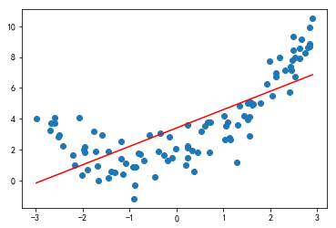


#### 正好拟合代码

```python
import numpy as np
from sklearn.linear_model import LinearRegression
from sklearn.metrics import mean_squared_error
import matplotlib.pyplot as plt

def dm02_模型ok():
    # 1. 准备x, y数据, 增加上噪声.
    # 用于设置随机数生成器的种子（seed）, 种子一样, 每次生成相同序列.
    np.random.seed(666)
    # x: 随机数, 范围为 (-3, 3), 100个.
    x = np.random.uniform(-3, 3, size=100)
    # loc: 均值, scale: 标准差, normal: 正态分布.
    y = 0.5 * x ** 2 + x + 2 + np.random.normal(0, 1, size=100)
    # 2. 实例化 线性回归模型.
    estimator = LinearRegression()
    # 3. 训练模型
    X = x.reshape(-1, 1)
    X2 = np.hstack([X, X ** 2])
    estimator.fit(X2, y)

    # 4. 模型预测.
    y_predict = estimator.predict(X2)
    print("预测值:", y_predict)

    # 5. 计算均方误差 => 模型评估
    print(f'均方误差: {mean_squared_error(y, y_predict)}')
    # 6. 画图
    plt.scatter(x, y)  # 散点图
    # sort()  该函数直接返回一个排序后的新数组。
    # numpy.argsort()   该函数返回的是数组值从小到大排序时对应的索引值
    plt.plot(np.sort(x), y_predict[np.argsort(x)], color='r')  # 折线图(预测值, 拟合回归线)
    # plt.plot(x, y_predict)
    plt.show()  # 具体的绘图
```

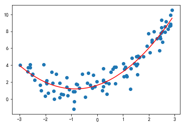

#### 过拟合代码

再次加入高次项，绘制图像，观察均方误差结果

```python
import numpy as np
import matplotlib.pyplot as plt
from sklearn.linear_model import LinearRegression
from sklearn.metrics import mean_squared_error  # 计算均方误差
from sklearn.model_selection import train_test_split


def dm03_过拟合():
    # 1. 准备x, y数据, 增加上噪声.
    # 用于设置随机数生成器的种子（seed）, 种子一样, 每次生成相同序列.
    np.random.seed(666)
    # x: 随机数, 范围为 (-3, 3), 100个.
    x = np.random.uniform(-3, 3, size=100)
    # loc: 均值, scale: 标准差, normal: 正态分布.
    y = 0.5 * x ** 2 + x + 2 + np.random.normal(0, 1, size=100)
    # 2. 实例化 线性回归模型.
    estimator = LinearRegression()
    # 3. 训练模型
    X = x.reshape(-1, 1)
    # hstack() 函数用于将多个数组在行上堆叠起来, 即: 数据增加高次项.
    X3 = np.hstack([X, X**2, X**3, X**4, X**5, X**6, X**7, X**8, X**9, X**10])
    estimator.fit(X3, y)

    # 4. 模型预测.
    y_predict = estimator.predict(X3)
    print("预测值:", y_predict)

    # 5. 计算均方误差 => 模型评估
    print(f'均方误差: {mean_squared_error(y, y_predict)}')
    # 6. 画图
    plt.scatter(x, y)  # 散点图
    # sort()  该函数直接返回一个排序后的新数组。
    # numpy.argsort()   该函数返回的是数组值从小到大排序时对应的索引值
    plt.plot(np.sort(x), y_predict[np.argsort(x)], color='r')  # 折线图(预测值, 拟合回归线)
    plt.show()  # 具体的绘图

if __name__ == '__main__':
    dm03_过拟合()

```


通过上述观察发现，随着加入的高次项越来越多，拟合程度越来越高，均方误差也随着加入越来越小。说明已经不再欠拟合了。

问题：如何判断出现过拟合呢？

将数据集进行划分：对比X、X2、X5的测试集的均方误差

X的测试集均方误差

```python
X_train,X_test,y_train,y_test = train_test_split(X,y,random_state = 5)
estimator = LinearRegression()
estimator.fit(X_train,y_train)
y_predict = estimator.predict(X_test)

mean_squared_error(y_test,y_predict)
#3.153139806483088
```

X2的测试集均方误差

```python
X_train,X_test,y_train,y_test = train_test_split(X2,y,random_state = 5)
estimator = LinearRegression()
estimator.fit(X_train,y_train)
y_predict = estimator.predict(X_test)
mean_squared_error(y_test,y_predict)
#1.111873885731967
```

X5的测试集的均方误差

```python
X_train,X_test,y_train,y_test = train_test_split(X5,y,random_state = 5)
estimator = LinearRegression()
estimator.fit(X_train,y_train)
y_predict = estimator.predict(X_test)
mean_squared_error(y_test,y_predict)
#1.4145580542309835
```

### 【理解】 拟合问题原因以及解决办法

1.**欠拟合产生原因：** 学习到数据的特征过少

解决办法：

**1）添加其他特征项**，有时出现欠拟合是因为特征项不够导致的，可以添加其他特征项来解决

**2）添加多项式特征**，模型过于简单时的常用套路，例如将线性模型通过添加二次项或三次项使模型泛化能力更强


2.**过拟合产生原因：** 原始特征过多，存在一些嘈杂特征， 模型过于复杂是因为模型尝试去兼顾所有测试样本

解决办法：

1）重新清洗数据，导致过拟合的一个原因有可能是数据不纯，如果出现了过拟合就需要重新清洗数据。

2）增大数据的训练量，还有一个原因就是我们用于训练的数据量太小导致的，训练数据占总数据的比例过小。

**3）正则化**

4）减少特征维度

### 【理解】正则化

在解决回归过拟合中，我们选择正则化。但是对于其他机器学习算法如分类算法来说也会出现这样的问题，除了一些算法本身作用之外（决策树、神经网络），我们更多的也是去自己做特征选择，包括之前说的删除、合并一些特征


**如何解决？**


**在学习的时候，数据提供的特征有些影响模型复杂度或者这个特征的数据点异常较多，所以算法在学习的时候尽量减少这个特征的影响（甚至删除某个特征的影响），这就是正则化**

注：调整时候，算法并不知道某个特征影响，而是去调整参数得出优化的结

#### **L1正则化**

- 假设𝐿(𝑊)是未加正则项的损失，𝜆是一个超参，控制正则化项的大小。
- 则最终的损失函数：$𝐿=𝐿(𝑊)+ \lambda*\sum_{i=1}^{n}\lvert w_i\rvert$ 

作用：用来进行特征选择，主要原因在于L1正则化会使得较多的参数为0，从而产生稀疏解,可以将0对应的特征遗弃，进而用来选择特征。一定程度上L1正则也可以防止模型过拟合。

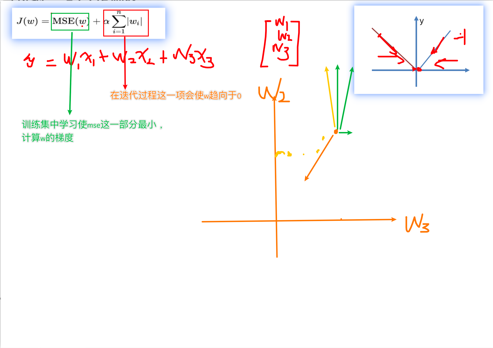

**L1正则为什么可以产生稀疏解（可以特征选择）**

稀疏性：向量中很多维度值为0

- 对其中的一个参数 $ w_i $ 计算梯度，其他参数同理，α是学习率，sign(wi)是符号函数。


L1的梯度：

$𝐿=𝐿(𝑊)+ \lambda*\sum_{i=1}^{n}\lvert w_i\rvert$ 

$\frac{\partial L}{\partial w_{i}} = \frac{\partial L(W)}{\partial w_{i}}+\lambda sign(w_{i})$

LASSO回归: from sklearn.linear_model import Lasso


#### **L2正则化**

- 假设𝐿(𝑊)是未加正则项的损失，𝜆是一个超参，控制正则化项的大小。
- 则最终的损失函数：$𝐿=𝐿(𝑊)+ \lambda*\sum_{i=1}^{n}w_{i}^{2}$ 

作用：主要用来防止模型过拟合，可以减小特征的权重

优点：越小的参数说明模型越简单，越简单的模型则越不容易产生过拟合现象

Ridge回归: from sklearn.linear_model import Ridge


#### L1正则化代码

```python
from sklearn.linear_model import Lasso  # L1正则
from sklearn.linear_model import Ridge  # 岭回归 L2正则

def dm04_模型过拟合_L1正则化():
    # 1. 准备x, y数据, 增加上噪声.
    # 用于设置随机数生成器的种子（seed）, 种子一样, 每次生成相同序列.
    np.random.seed(666)
    # x: 随机数, 范围为 (-3, 3), 100个.
    x = np.random.uniform(-3, 3, size=100)
    # loc: 均值, scale: 标准差, normal: 正态分布.
    y = 0.5 * x ** 2 + x + 2 + np.random.normal(0, 1, size=100)
    # 2. 实例化L1正则化模型, 做实验: alpha惩罚力度越来越大, k值越来越小.
    estimator = Lasso(alpha=0.005)
    # 3. 训练模型
    X = x.reshape(-1, 1)
    # hstack() 函数用于将多个数组在行上堆叠起来, 即: 数据增加高次项.
    X3 = np.hstack([X, X**2, X**3, X**4, X**5, X**6, X**7, X**8, X**9, X**10])
    estimator.fit(X3, y)
    print(f'权重: {estimator.coef_}')

    # 4. 模型预测.
    y_predict = estimator.predict(X3)
    print("预测值:", y_predict)

    # 5. 计算均方误差 => 模型评估
    print(f'均方误差: {mean_squared_error(y, y_predict)}')
    # 6. 画图
    plt.scatter(x, y)  # 散点图
    # sort()  该函数直接返回一个排序后的新数组。
    # numpy.argsort()   该函数返回的是数组值从小到大排序时对应的索引值
    plt.plot(np.sort(x), y_predict[np.argsort(x)], color='r')  # 折线图(预测值, 拟合回归线)
    plt.show()  # 具体的绘图
    
if __name__ == '__main__':
    dm04_模型过拟合_L1正则化()

```

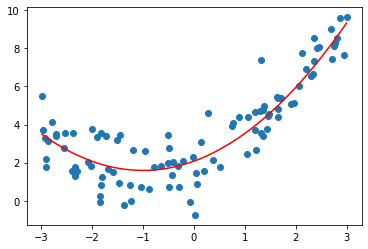

```python
import numpy as np
import matplotlib.pyplot as plt
from sklearn.linear_model import LinearRegression, Lasso, Ridge
from sklearn.metrics import mean_squared_error  # 计算均方误差
from sklearn.model_selection import train_test_split


def dm05_模型过拟合_L2正则化():
    # 1. 准备x, y数据, 增加上噪声.
    # 用于设置随机数生成器的种子（seed）, 种子一样, 每次生成相同序列.
    np.random.seed(666)
    # x: 随机数, 范围为 (-3, 3), 100个.
    x = np.random.uniform(-3, 3, size=100)
    # loc: 均值, scale: 标准差, normal: 正态分布.
    y = 0.5 * x ** 2 + x + 2 + np.random.normal(0, 1, size=100)
    # 2. 实例化L2正则化模型, 做实验: alpha惩罚力度越来越大, k值越来越小.
    estimator = Ridge(alpha=0.005)
    # 3. 训练模型
    X = x.reshape(-1, 1)
    # hstack() 函数用于将多个数组在行上堆叠起来, 即: 数据增加高次项.
    X3 = np.hstack([X, X**2, X**3, X**4, X**5, X**6, X**7, X**8, X**9, X**10])
    estimator.fit(X3, y)
    print(f'权重: {estimator.coef_}')

    # 4. 模型预测.
    y_predict = estimator.predict(X3)
    print("预测值:", y_predict)

    # 5. 计算均方误差 => 模型评估
    print(f'均方误差: {mean_squared_error(y, y_predict)}')
    # 6. 画图
    plt.scatter(x, y)  # 散点图
    # sort()  该函数直接返回一个排序后的新数组。
    # numpy.argsort()   该函数返回的是数组值从小到大排序时对应的索引值
    plt.plot(np.sort(x), y_predict[np.argsort(x)], color='r')  # 折线图(预测值, 拟合回归线)
    plt.show()  # 具体的绘图

if __name__ == '__main__':
    # dm04_模型过拟合_L1正则化()
    dm05_模型过拟合_L2正则化()

```


## 作业

1.完成线性回归部分的思维导图


2.回归任务的评估方法?


3.说明欠拟合和过拟合的表现形式?


4.说明欠拟合和过拟合的产生原因和解决方法


4.简述下L1和L2正则化方法?


