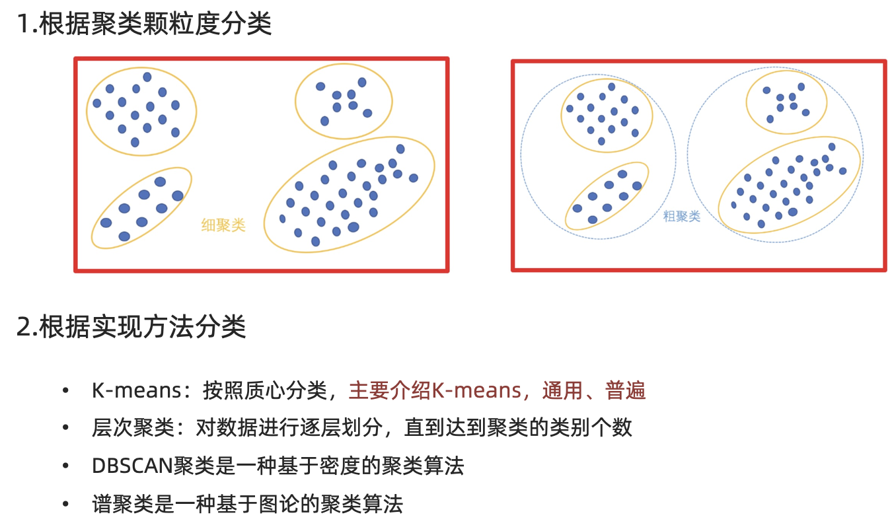
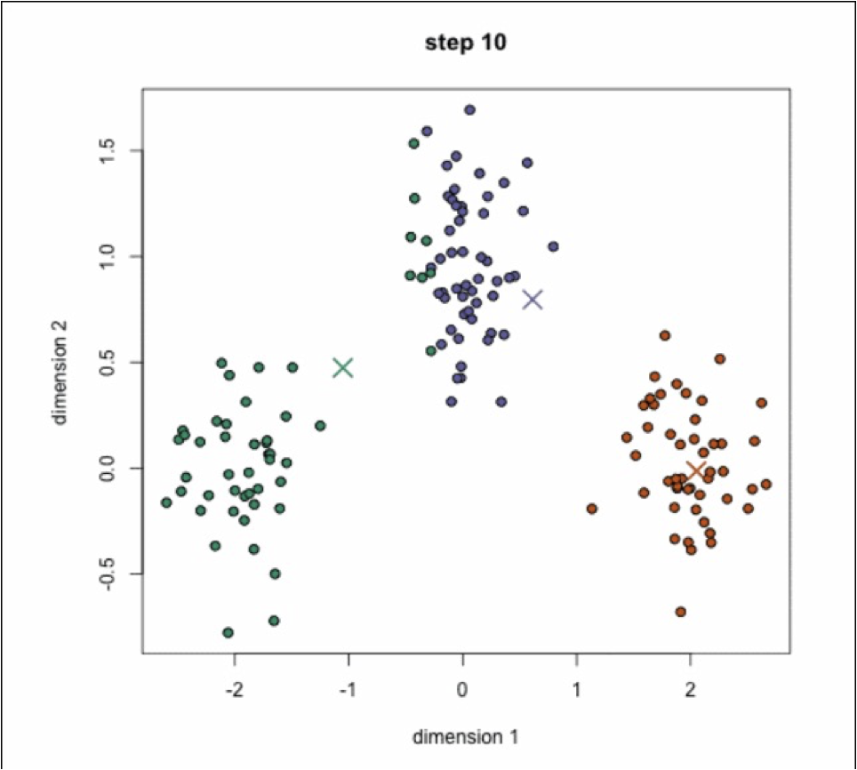
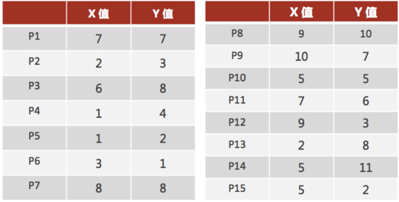
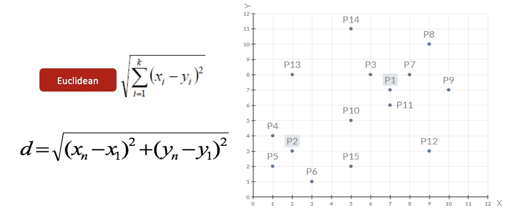
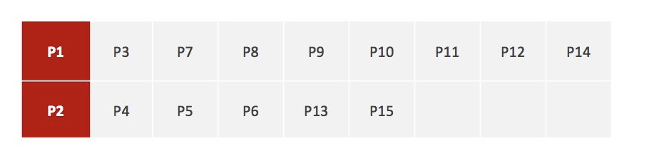
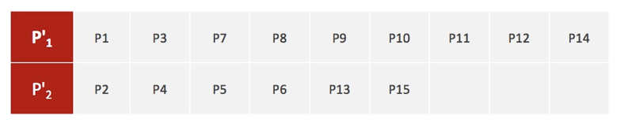
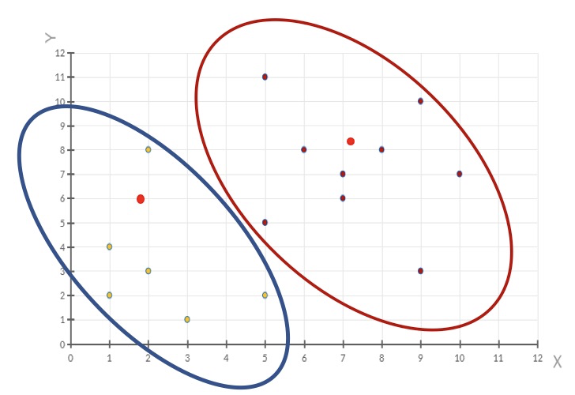
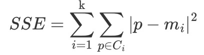

# 聚类

## 聚类算法简介

**学习目标：**

1.知道什么是聚类

2.了解聚类算法的应用场景

3.知道聚类算法的分类

### 【知道】聚类算法介绍

一种典型的无监督学习算法，主要用于将相似的样本自动归到一个类别中。

在聚类算法中根据样本之间的相似性，将样本划分到不同的类别中，对于不同的相似度计算方法，会得到不同的聚类结果，常用的相似度计算方法有欧式距离法。


### 【了解】聚类算法在现实中的应用

- 用户画像，广告推荐，Data Segmentation，搜索引擎的流量推荐，恶意流量识别
- 基于位置信息的商业推送，新闻聚类，筛选排序
- 图像分割，降维，识别；离群点检测；信用卡异常消费；发掘相同功能的基因片段


### 【知道】分类



## 聚类API的初步使用

**学习目标：**

1.了解Kmeans算法的API

2.动手实践Kmeans算法

### 【了解】api介绍

- sklearn.cluster.KMeans(n_clusters=8)
  - 参数:
    - n_clusters:开始的聚类中心数量
      - 整型，缺省值=8，生成的聚类数，即产生的质心（centroids）数。
  - 方法:
    - estimator.fit(x)
    - estimator.predict(x)
    - estimator.fit_predict(x)
      - 计算聚类中心并预测每个样本属于哪个类别,相当于先调用fit(x),然后再调用predict(x)

### 【实践】 案例

随机创建不同二维数据集作为训练集，并结合k-means算法将其聚类，你可以尝试分别聚类不同数量的簇，并观察聚类效果：


1.创建数据集

```python
import matplotlib.pyplot as plt
from sklearn.datasets.samples_generator import make_blobs
from sklearn.cluster import KMeans
from sklearn.metrics import calinski_harabaz_score

# 创建数据集
# X为样本特征，Y为样本簇类别， 共1000个样本，每个样本2个特征，共4个簇，
# 簇中心在[-1,-1], [0,0],[1,1], [2,2]， 簇方差分别为[0.4, 0.2, 0.2, 0.2]
X, y = make_blobs(n_samples=1000, n_features=2, centers=[[-1, -1], [0, 0], [1, 1], [2, 2]],
                  cluster_std=[0.4, 0.2, 0.2, 0.2],
                  random_state=9)

# 数据集可视化
plt.scatter(X[:, 0], X[:, 1], marker='o')
plt.show()
```

2.使用k-means进行聚类,并使用CH方法评估

```python
y_pred = KMeans(n_clusters=2, random_state=9).fit_predict(X)
# 分别尝试n_cluses=2\3\4,然后查看聚类效果
plt.scatter(X[:, 0], X[:, 1], c=y_pred)
plt.show()

# 用Calinski-Harabasz Index评估的聚类分数
print(calinski_harabasz_score(X, y_pred))
```


## Kmeans算法流程

**学习目标**

1、理解Kmeans算法的执行过程

### 【掌握】k-means聚类流程

1、随机设置K个特征空间内的点作为初始的聚类中心

2、对于其他每个点计算到K个中心的距离，未知的点选择最近的一个聚类中心点作为标记类别

3、接着对着标记的聚类中心之后，重新计算出每个聚类的新中心点（平均值）

4、如果计算得出的新中心点与原中心点一样（质心不再移动），那么结束，否则重新进行第二步过程

通过下图解释实现流程：


k-means聚类动态效果图：



### 【练习】案例练习

- 案例：



1、随机设置K个特征空间内的点作为初始的聚类中心（本案例中设置p1和p2）



2、对于其他每个点计算到K个中心的距离，未知的点选择最近的一个聚类中心点作为标记类别




3、接着对着标记的聚类中心之后，重新计算出每个聚类的新中心点（平均值）


注意：这里P2′=(2.3,3.3)，下同。

4、如果计算得出的新中心点与原中心点一样（质心不再移动），那么结束，否则重新进行第二步过程【经过判断，需要重复上述步骤，开始新一轮迭代】




5、当每次迭代结果不变时，认为算法收敛，聚类完成，**K-Means一定会停下，不可能陷入一直选质心的过程。**




## 评价指标

学习目标:

1. 了解 SSE 聚类评估指标
2. 了解 SC 聚类评估指标
3. 了解 CH 聚类评估指标
4. 了解肘方法的作用


### 【了解】 SSE-误差平方和



1. K 表示聚类中心的个数

2. C<sub>i</sub> 表示簇

3. p 表示样本

4. m<sub>i</sub> 表示簇的质心

   

SSE 越小，表示数据点越接近它们的中心，聚类效果越好。

### 【了解】SC 系数

结合了聚类的凝聚度（Cohesion）和分离度（Separation），用于评估聚类的效果。


其计算过程如下：

1. 计算每一个样本 i 到同簇内其他样本的平均距离 a<sub>i</sub>，该值越小，说明簇内的相似程度越大
2. 计算每一个样本 i 到最近簇 j 内的所有样本的平均距离 b<sub>ij</sub>，该值越大，说明该样本越不属于其他簇 j
3. 计算所有样本的平均轮廓系数
4. 轮廓系数的范围为：[-1, 1]，值越大聚类效果越好

###   【了解】肘部法

肘部法可以用来确定 K 值.

- 对于n个点的数据集，迭代计算 k from 1 to n，每次聚类完成后计算 SSE 

- SSE 是会逐渐变小的，因为每个点都是它所在的簇中心本身。

- SSE 变化过程中会出现一个拐点，下降率突然变缓时即认为是最佳 n_clusters 值。

- 在决定什么时候停止训练时，肘形判据同样有效，数据通常有更多的噪音，在增加分类无法带来更多回报时，我们停止增加类别。


### 【了解】CH 系数

CH 系数结合了聚类的凝聚度（Cohesion）和分离度（Separation）、质心的个数，希望用最少的簇进行聚类。


SSW 的含义：

1. C<sub>pi</sub> 表示质心
2. x<sub>i</sub> 表示某个样本
3. SSW 值是计算每个样本点到质心的距离，并累加起来
4. SSW 表示表示簇内的内聚程度，越小越好
5. m 表示样本数量
6. k 表示质心个数

SSB 的含义：

1. C<sub>j</sub> 表示质心，X 表示质心与质心之间的中心点，n<sub>j</sub> 表示样本的个数
2. SSB 表示簇与簇之间的分离度，SSB 越大越好

### 【实践】聚类评估的使用

```python
from sklearn.datasets import make_blobs
from sklearn.cluster import KMeans
import matplotlib.pyplot as plt
from sklearn.metrics import silhouette_score
from sklearn.metrics import calinski_harabasz_score


if __name__ == '__main__':
    x, y = make_blobs(n_samples=1000,
                      n_features=2,
                      centers=[[-1, -1], [0, 0], [1, 1], [2, 2]],
                      cluster_std=[0.4, 0.2, 0.2, 0.2],
                      random_state=9)

    plt.figure(figsize=(18, 8), dpi=80)
    plt.scatter(x[:, 0], x[:, 1], c=y)
    plt.show()

    estimator = KMeans(n_clusters=4, random_state=0)
    estimator.fit(x)
    y_pred = estimator.predict(x)

    # 1. 计算 SSE 值
    print('SSE:', estimator.inertia_)

    # 2. 计算 SC 系数
    print('SC:', silhouette_score(x, y_pred))

    # 3. 计算 CH 系数
    print('CH:', calinski_harabasz_score(x, y_pred))
```


## 【实践】案例

### 【了解】案例介绍

已知：客户性别、年龄、年收入、消费指数

需求：对客户进行分析，找到业务突破口，寻找黄金客户


数据集共包含顾客的数据, 数据共有 4 个特征, 数据共有 200 条。接下来，使用聚类算法对具有相似特征的的顾客进行聚类，并可视化聚类结果。

### 【实践】案例实现

```python
# -*- coding: utf-8 -*-
"""
任务需求：对客户数据，根据收入和消费指数进行聚类
实现步骤：
    1.加载数据并提取进行聚类的特征数据
    2.寻找最佳K个聚类中心
    3.聚类
    4.聚类结果展示
"""
import pandas as pd
import matplotlib.pyplot as plt
from sklearn.cluster import KMeans
from sklearn.metrics import silhouette_score

# 1.加载数据并提取进行聚类的特征数据
customers_data = pd.read_csv('data/customers.csv')
print(customers_data.info())
# 没有缺失值，取Annual Income (k$)以及Spending Score (1-100)这两个特征进行聚类
x = customers_data.iloc[:, 3:]


def find_best_k():
    # 2.寻找最佳K个聚类中心--->肘部法则
    # 通过肘部法则，最佳的K值是5
    sse_list = []
    sc_list = []
    for i in range(2, 11):
        k_means = KMeans(n_clusters=i)
        k_means.fit(x)
        # 统计SSE
        sse_list.append(k_means.inertia_)
        # 统计SC轮廓系数
        labels = k_means.predict(x)
        sc_score = silhouette_score(x, labels)
        sc_list.append(sc_score)
    fig = plt.figure(figsize=(20, 10))
    # 绘制SSE折线图
    ax1 = fig.add_subplot(121)
    ax1.plot(range(2, 11), sse_list, 'or-')
    ax1.set_ylabel = 'SSE'
    ax1.set_xlabel = 'K'
    ax1.grid()
    # 绘制SC轮廓系数折线图
    ax2 = fig.add_subplot(122)
    ax2.plot(range(2, 11), sc_list, 'or-')
    ax2.set_ylabel = 'SC'
    ax2.set_xlabel = 'K'
    ax2.grid()
    plt.show()


def show_result():
    # 3.聚类
    k_means = KMeans(n_clusters=5)
    y_labels = k_means.fit_predict(x)
    # 4.聚类结果展示
    # 绘制第1类数据点，使用红色标记，标签为'Standard'
    plt.scatter(x.values[y_labels == 0, 0], x.values[y_labels == 0, 1], s=100, c='red', label='Standard')
    # 绘制第2类数据点，使用蓝色标记，标签为'Traditional'
    plt.scatter(x.values[y_labels == 1, 0], x.values[y_labels == 1, 1], s=100, c='blue', label='Traditional')
    # 绘制第3类数据点，使用绿色标记，标签为'Normal'
    plt.scatter(x.values[y_labels == 2, 0], x.values[y_labels == 2, 1], s=100, c='green', label='Normal')
    # 绘制第4类数据点，使用青色标记，标签为'Youth'
    plt.scatter(x.values[y_labels == 3, 0], x.values[y_labels == 3, 1], s=100, c='cyan', label='Youth')
    # 绘制第5类数据点，使用洋红标记，标签为'TA'
    plt.scatter(x.values[y_labels == 4, 0], x.values[y_labels == 4, 1], s=100, c='magenta', label='TA')
    # 绘制聚类中心点，使用黑色标记，标签为'Centroids'
    plt.scatter(k_means.cluster_centers_[:, 0], k_means.cluster_centers_[:, 1], s=300, c='black', label='Centroids')

    # 5.画图
    plt.title('Clusters of customers')
    plt.xlabel('Annual Income')
    plt.ylabel('Spending Score')
    plt.legend()
    plt.show()


if __name__ == '__main__':
    show_result()

```

## 作业

1.使用思维导图总结聚类算法部分的内容


2.动手实现课程中的代码